# 🌐 Job Integration Gateway

An asynchronous, high-performance job aggregator API built with **FastAPI**. It fetches, normalizes, and serves tech job postings from multiple external APIs (**Jooble, Remotive, Arbeitnow, Jobicy**) in real time.

Designed as a stateless middleware layer implementing the **Adapter Pattern**, concurrent API orchestration, Pydantic schema validation, and in-memory TTL caching.

---
<p align="center">
  
</p>
---

## 🌍 Provider Coverage

| Provider | Type | Primary Coverage | Authentication |
|---|---|---|:---:|
| **Jooble** | Global Aggregator | Worldwide (DACH, CEE, EU, US, 60+ countries) | API Key |
| **Remotive** | Remote Tech Jobs | Worldwide Remote, Tech-focused | Free / Open |
| **Arbeitnow** | European Tech Jobs | Germany, EU, Remote | Free / Open |
| **Jobicy** | Remote Jobs | Global Remote & Regional Hubs | Free / Open |

---

## 🏗️ Architecture & Data Pipeline

## 🌍 Geographic Coverage

The gateway queries jobs by passing a `location` parameter through to each provider, so coverage depends on which countries Adzuna and Jooble support. Both providers have broad international reach, with strong coverage in Europe:

| Region | Example Locations | Jooble | Remotive | Arbeitnow | Jobicy |
|---|---|:---:|:---:|:---:|:---:|
| **DACH** | Berlin, Munich, Hamburg, Vienna, Zurich | ✅ | ✅ | ✅ | ✅ |
| **Central & Eastern Europe** | Warsaw, Kraków, Prague, Budapest | ✅ | ✅ | ✅ | ✅ |
| **Western Europe** | London, Paris, Amsterdam, Brussels | ✅ | ✅ | ✅ | ✅ |
| **Southern Europe** | Madrid, Rome, Lisbon | ✅ | ✅ | ✅ | ✅ |
| **Nordics** | Stockholm, Copenhagen, Oslo | ✅ | ✅ | ✅ | ✅ |
| **North America** | US, Canada | ✅ | ✅ | ✅ | ✅ |
| **Worldwide Remote** | Remote, Anywhere, CET Timezone | ✅ | ✅ | ✅ | ✅ |

---

## 🏗️ Architecture & Flow

The **Job Integration Gateway** acts as a stateless middleware layer designed around asynchronous execution, schema normalization, and resilient API handling.

```
┌─────────────────────────────────────────────────────────────────────┐
│ CLIENT LAYER                                                        │
│ Frontend Web App / Postman / Swagger UI (/docs)                     │
└─────────────────────────────────────────────────────────────────────┘
                              │
                              │ HTTP GET /api/v1/jobs?keyword=QA&location=Berlin
                              ▼
┌─────────────────────────────────────────────────────────────────────┐
│ FASTAPI GATEWAY                                                     │
│                                                                     │
│ 1. Request Handler & Query Validation (Pydantic)                    │
│ 2. Cache Check Layer (TTL In-Memory Cache)                          │
│    ├── [ Cache Hit ] ──▶ Return cached JSON immediately             │
│    └── [ Cache Miss ] ──▶ Proceed to Async Fetchers                 │
└─────────────────────────────────────────────────────────────────────┘
                              │
        ┌─────────────────────┼─────────────────────┬─────────────────┐
        │                     │                     │                 │
        ▼                     ▼                     ▼                 ▼
   ┌───────────┐        ┌───────────┐        ┌───────────┐     ┌───────────┐
   │ JOOBLE    │        │ REMOTIVE  │        │ ARBEITNOW │     │ JOBICY    │
   │ CLIENT    │        │ CLIENT    │        │ CLIENT    │     │ CLIENT    │
   │           │        │           │        │           │     │           │
   │ • POST API│        │ • GET API │        │ • GET API │     │ • GET API │
   │ • JSON Body│       │ • Query   │        │ • Open    │     │ • Open    │
   └───────────┘        └───────────┘        └───────────┘     └───────────┘
        │                     │                     │                 │
        └─────────────────────┴─────────────────────┴─────────────────┘
                              │
                   Raw JSON Streams
                              ▼
┌─────────────────────────────────────────────────────────────────────┐
│ NORMALIZER / ADAPTER LAYER                                          │
│                                                                     │
│ • Maps provider-specific JSON schemas into a unified domain model   │
│ • Cleans raw text (removes HTML tags, formats currency strings)     │
│ • Handles fallback values for missing attributes (e.g., company)    │
└─────────────────────────────────────────────────────────────────────┘
                              │
                              ▼
┌─────────────────────────────────────────────────────────────────────┐
│ AGGREGATION & DEDUPLICATION                                         │
│                                                                     │
│ • Combines dataset streams into a single list                       │
│ • Filters domain relevance (QA/Testing) & regional matching         │
│ • Deduplicates jobs based on normalized title + company hashing     │
│ • Updates TTL Cache entry                                           │
└─────────────────────────────────────────────────────────────────────┘
                              │
                   200 OK — Standardized JSON Response
                              ▼
┌─────────────────────────────────────────────────────────────────────┐
│ CLIENT LAYER                                                        │
└─────────────────────────────────────────────────────────────────────┘
```

---

## 🗺️ Development Roadmap

The full milestone-by-milestone development plan (setup, domain models, provider clients, adapters, aggregation, API, frontend, testing, deployment, and stretch goals) lives in a separate file to keep this README focused:

👉 **[ROADMAP.md](./ROADMAP.md)**
